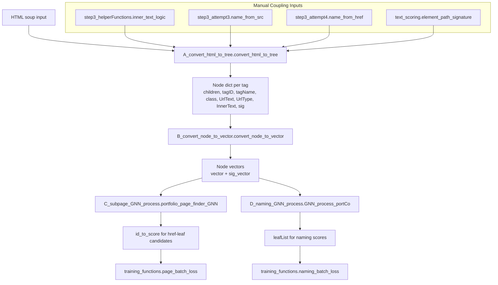

# Local Change Flowchart (Prompt 5 Scope)

## What this map is for
- Defines the exact local boundary where Prompt 5 checks coupling contracts.
- Ensures return types from manual helpers match what the tree/vector/model code consumes.
- Highlights where malformed fields silently degrade features vs hard-crash.
